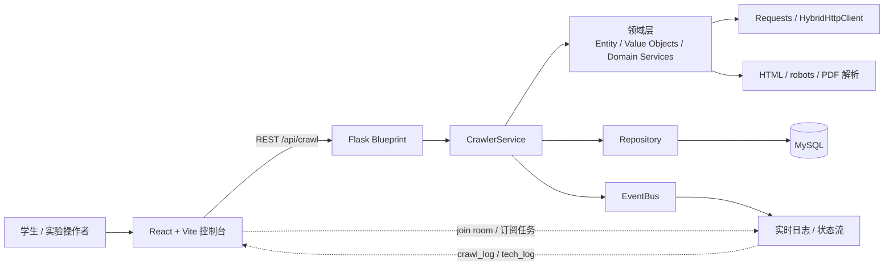
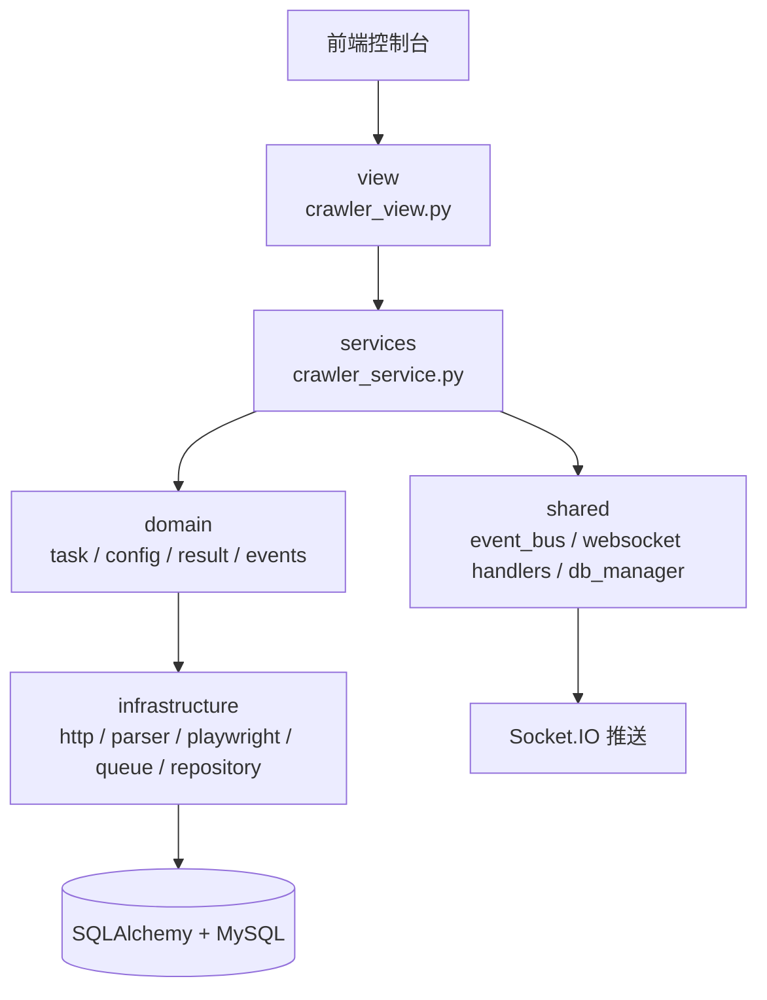
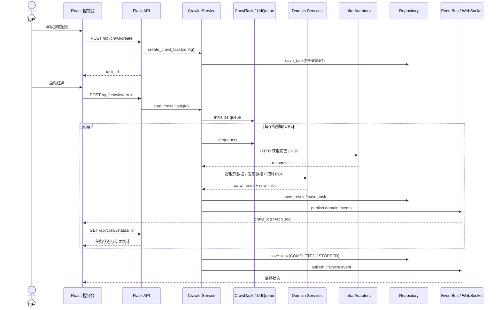
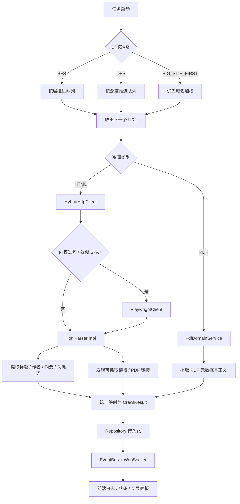
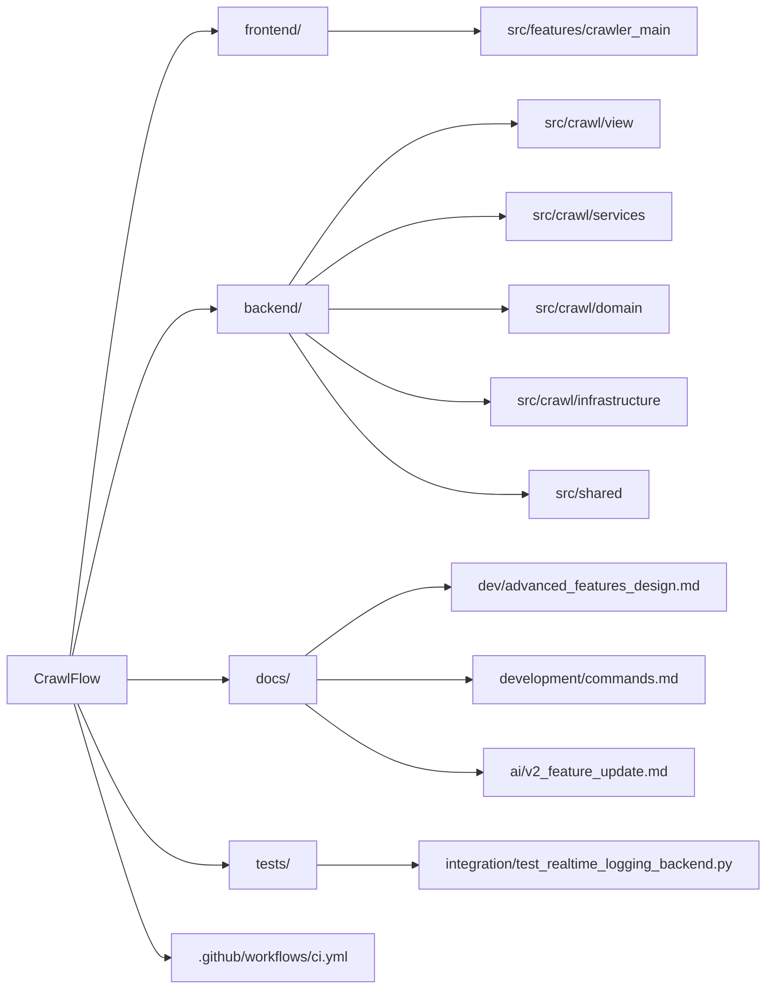

# CrawlFlow

[](LICENSE)


CrawlFlow 是一个面向实验、课程设计和爬虫原型验证场景的全栈抓取平台。项目整合了 Flask 后端、React/Vite 控制台、SQLAlchemy + MySQL 持久化，以及基于 Socket.IO 的实时日志与状态回传能力。

它的重点不只是“能抓取”，而是把任务创建、策略调度、动态页面回退渲染、PDF 提取、结果导出和实时观测串成一个完整工作流，方便演示、调试和扩展。

## 项目亮点

- 支持多种抓取策略：BFS、DFS 与大站优先调度。
- 支持实时监控：在 Web 界面中查看日志、任务状态和结果增量刷新。
- 提供丰富的数据提取能力：元数据解析、PDF 发现、结果导出与 `robots.txt` 检查。
- 后端采用分层设计：`view -> services -> domain -> infrastructure -> shared`，便于课程展示与后续演进。
- 已预留高级扩展方向：Hybrid HTTP / Playwright 回退渲染、动态域名评分、PDF 专用处理链路。

## 架构总览

### 系统上下文图



### 后端分层设计



### 分层职责对照

| 层级 | 代码位置 | 主要职责 |
| --- | --- | --- |
| 表现层 | `frontend/src/features/crawler_main` | 创建任务、展示状态、查看日志、导出结果 |
| 接口层 | `backend/src/crawl/view` | 提供 REST API，组装后端依赖，暴露导出/状态/控制接口 |
| 应用层 | `backend/src/crawl/services` | 管理任务生命周期、线程执行、队列推进与状态查询 |
| 领域层 | `backend/src/crawl/domain` | 封装任务实体、值对象、领域事件与核心规则 |
| 基础设施层 | `backend/src/crawl/infrastructure` | HTTP 请求、Playwright 回退、HTML/PDF 解析、队列和仓储实现 |
| 共享能力 | `backend/src/shared` | EventBus、WebSocket 推送、数据库 Session 管理 |

## 设计图表

### 一次抓取任务的执行时序



### 抓取决策与数据流



### 仓库与文档地图



## 仓库结构

```text
.
|-- .github/                # Issue/PR 模板与 CI 配置
|-- backend/                # Flask 后端、领域模型、持久化与日志
|   |-- docs/               # 后端专用图示与技术资产
|   |-- src/
|   |   |-- crawl/
|   |   |   |-- view/       # Flask Blueprint 与组合根
|   |   |   |-- services/   # 应用服务与任务编排
|   |   |   |-- domain/     # 实体、值对象、领域服务、事件
|   |   |   `-- infrastructure/
|   |   `-- shared/         # EventBus、WebSocket、数据库管理
|   `-- test/               # 后端单元/集成测试
|-- docs/                   # 项目文档、设计说明与命令参考
|-- frontend/               # React + Vite 控制台
|   |-- src/
|   `-- test/
|-- tests/                  # 仓库级回归与跨模块集成测试
|-- CHANGELOG.md
|-- CODE_OF_CONDUCT.md
|-- CONTRIBUTING.md
|-- LICENSE
|-- README.md
`-- SECURITY.md
```

## 快速开始

### 后端

```bash
cd backend
python -m venv .venv
.\.venv\Scripts\activate
pip install -r requirements.txt
copy .env.example .env
python run.py
```

如果你准备启用混合渲染链路，请额外安装一次 Playwright 浏览器：

```bash
playwright install chromium
```

### 前端

```bash
cd frontend
npm install
npm run dev
```

### 默认本地地址

- 前端控制台：`http://localhost:5173`
- 后端 API 与 Socket.IO：`http://localhost:5000`

## 测试

当前仓库包含：

- `22` 个后端单元/集成测试
- `1` 个前端集成测试
- `1` 个仓库级跨模块回归测试

运行方式：

```bash
# 后端测试
cd backend
python -m pytest test

# 前端测试
cd frontend
npm test -- --run

# 仓库级测试
cd ..
python -m pytest tests
```

## 文档导航

- [文档索引](docs/README.md)
- [进阶功能设计方案](docs/dev/advanced_features_design.md)
- [v2 功能更新记录](docs/ai/v2_feature_update.md)
- [开发命令速查](docs/development/commands.md)
- [仓库级测试说明](tests/README.md)

## 协作说明

- 贡献流程请见 [CONTRIBUTING.md](CONTRIBUTING.md)
- 社区行为规范请见 [CODE_OF_CONDUCT.md](CODE_OF_CONDUCT.md)
- 安全问题披露请见 [SECURITY.md](SECURITY.md)

## 许可

本项目基于 [MIT License](LICENSE) 发布，中文说明可参考 [LICENSE.zh-CN.md](LICENSE.zh-CN.md)。
