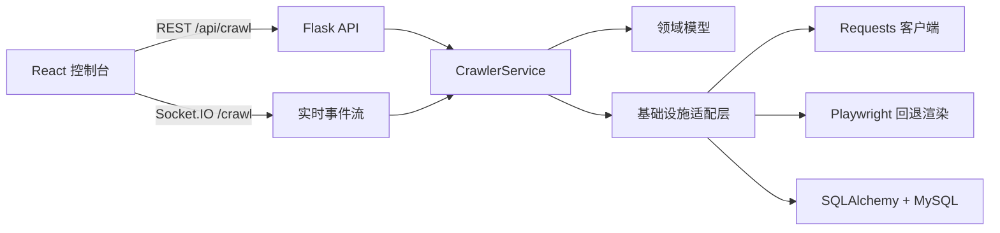

# CrawlFlow

[](LICENSE)


CrawlFlow 是一个面向实验与课程设计场景的全栈爬虫平台。项目整合了 Flask 后端、React/Vite 控制台、MySQL 持久化能力，以及基于 Socket.IO 的实时爬取遥测能力。

## 项目亮点

- 支持多种爬取策略：BFS、DFS 与大站优先调度。
- 支持实时监控：在 Web 界面中查看实时日志、任务状态与爬取结果。
- 提供丰富的数据提取能力：元数据解析、PDF 发现、结果导出与 `robots.txt` 检查。
- 后端采用可扩展设计：基于领域驱动分层，按 HTTP、解析、存储与事件投递等职责进行适配。
- 持续演进中的高级能力已整理在 `docs/` 中，包括 Playwright 混合渲染与动态域名评分。

## 架构概览



## 仓库结构

```text
.
|-- .github/                # Issue/PR 模板与仓库自动化配置
|-- backend/                # Flask 后端、领域模型、持久化与日志
|   |-- docs/               # 后端专用图示与技术资产
|   |-- src/
|   `-- test/
|-- docs/                   # 项目文档、设计说明与命令参考
|   |-- ai/
|   |-- dev/
|   |-- development/
|   `-- project/
|-- frontend/               # React + Vite 控制台
|   |-- src/
|   `-- test/
|-- tests/                  # 仓库级回归与集成测试
|   `-- integration/
|-- CHANGELOG.md
|-- CODE_OF_CONDUCT.md
|-- CONTRIBUTING.md
|-- LICENSE
|-- README.md
`-- SECURITY.md
```

## 快速开始

### 后端

```bash
cd backend
python -m venv .venv
.\.venv\Scripts\activate
pip install -r requirements.txt
copy .env.example .env
python run.py
```

如果你准备启用混合渲染链路，请额外安装一次 Playwright 浏览器：

```bash
playwright install chromium
```

### 前端

```bash
cd frontend
npm install
npm run dev
```

### 默认本地地址

- 前端控制台：`http://localhost:5173`
- 后端 API 与 Socket.IO 服务：`http://localhost:5000`

## 测试

```bash
# 后端测试
cd backend
python -m pytest test

# 前端测试
cd frontend
npm test -- --run

# 仓库级测试
cd ..
python -m pytest tests
```

## 文档导航

- [文档索引](docs/README.md)
- [进阶功能设计方案](docs/dev/advanced_features_design.md)
- [v2 功能更新记录](docs/ai/v2_feature_update.md)
- [开发命令速查](docs/development/commands.md)
- [仓库级测试说明](tests/README.md)

## 协作说明

- 贡献流程请见 [CONTRIBUTING.md](CONTRIBUTING.md)
- 社区行为规范请见 [CODE_OF_CONDUCT.md](CODE_OF_CONDUCT.md)
- 安全问题披露请见 [SECURITY.md](SECURITY.md)

## 许可证

本项目基于 [MIT License](LICENSE) 发布，中文说明可参考 [LICENSE.zh-CN.md](LICENSE.zh-CN.md)。
